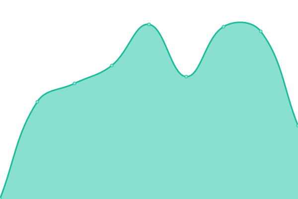
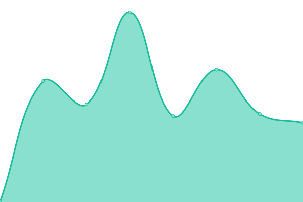
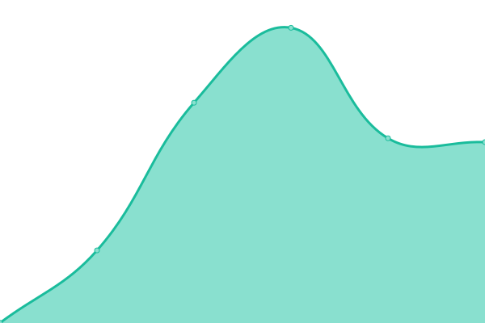

# [📈 Live Status](https://status.mn-netz.de): <!--live status--> **🟩 All systems operational**

This repository contains the open-source uptime monitor and status page for [Upptime](https://upptime.js.org), powered by [Upptime](https://github.com/upptime/upptime).

With [Upptime](https://upptime.js.org), you can get your own unlimited and free uptime monitor and status page, powered entirely by a GitHub repository. We use [Issues](https://github.com/upptime/upptime/issues) as incident reports, [Actions](https://github.com/tinsever/upptime-mn/actions) as uptime monitors, and [Pages](https://status.mn-netz.de) for the status page.

<!--start: status pages-->
<!-- This summary is generated by Upptime (https://github.com/upptime/upptime) -->
<!-- Do not edit this manually, your changes will be overwritten -->
<!-- prettier-ignore -->
| URL | Status | History | Response Time | Uptime |
| --- | ------ | ------- | ------------- | ------ |
|  [FOREX-Börse](https://fin.mn-netz.de) | 🟩 Up | [forex-boerse.yml](https://github.com/tinsever/upptime-mn/commits/HEAD/history/forex-boerse.yml) | 

 808ms
     
 | 

<a href="https://status.mn-netz.de/history/forex-boerse">100.00%</a>
    

|  [NETZ-API](https://api.mn-netz.de) | 🟩 Up | [netz-api.yml](https://github.com/tinsever/upptime-mn/commits/HEAD/history/netz-api.yml) | 

 703ms
     
 | 

<a href="https://status.mn-netz.de/history/netz-api">100.00%</a>
    

|  [NETZ-Dashboard](https://dash.mn-netz.de) | 🟩 Up | [netz-dashboard.yml](https://github.com/tinsever/upptime-mn/commits/HEAD/history/netz-dashboard.yml) | 

 1136ms
     
 | 

<a href="https://status.mn-netz.de/history/netz-dashboard">100.00%</a>
    

|  [Konferenz der Nationen](https://rdn.mn-netz.de) | 🟩 Up | [konferenz-der-nationen.yml](https://github.com/tinsever/upptime-mn/commits/HEAD/history/konferenz-der-nationen.yml) | 

 1834ms
     
 | 

<a href="https://status.mn-netz.de/history/konferenz-der-nationen">100.00%</a>
    

|  [Marktplatz](https://mn-marktplatz.de) | 🟩 Up | [marktplatz.yml](https://github.com/tinsever/upptime-mn/commits/HEAD/history/marktplatz.yml) | 

 1634ms
     
 | 

<a href="https://status.mn-netz.de/history/marktplatz">99.66%</a>
    

|  [Wiki](https://mn-wiki.de) | 🟩 Up | [wiki.yml](https://github.com/tinsever/upptime-mn/commits/HEAD/history/wiki.yml) | 

 1729ms
     
 | 

<a href="https://status.mn-netz.de/history/wiki">100.00%</a>
    

<!--end: status pages-->

[**Visit our status website →**](https://status.mn-netz.de)

## 📄 License

- Powered by: [Upptime](https://github.com/upptime/upptime)
- Code: [MIT](./LICENSE) © [Anand Chowdhary](https://anandchowdhary.com), supported by [Pabio](https://pabio.com)
- Data in the `./history` directory: [Open Database License](https://opendatacommons.org/licenses/odbl/1-0/)
